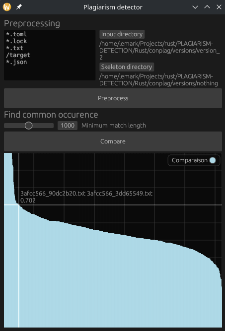

# Plagiarism detection application1
## Building from source
1. Install [Rust](https://www.rust-lang.org/tools/install)
2. Clone this repository
3. Go into the Rust folder
4. Execute the command: `cargo install --path .`

## Screenshots
